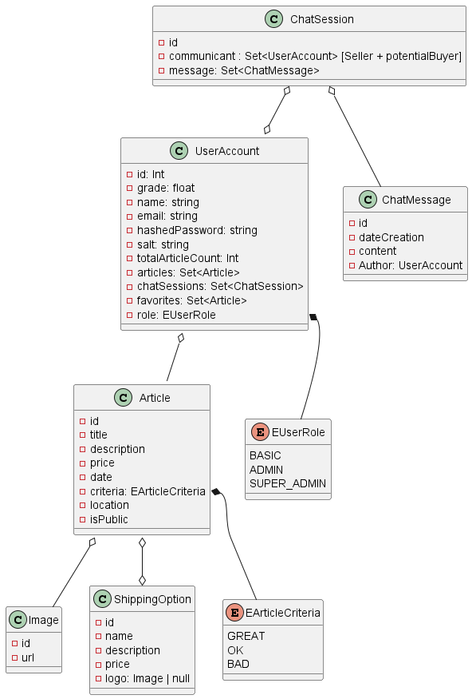
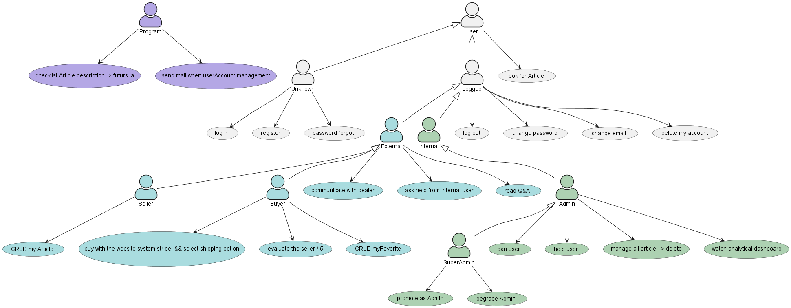

# Technologies

| side     | name       | utilisation                                                           |
| -------- | ---------- | --------------------------------------------------------------------- |
| both 🟫  | typescript | language surcouche a javascript (typage)                              |
| both 🟫  | yup        | schema valider pour js/ts utilisable pour instancier des interface ts |
| both 🟫  | jest       | framework js/ts de test                                               |
| front ⬜ | react      | framework SPA js/ts                                                   |
| front ⬜ | formik     | librairie pour les formulaire react                                   |
| back ⬛  | express    | framework http rest                                                   |
| back ⬛  | typeorm    | typescript Orm                                                        |
|          |            |                                                                       |

# Setup

docker compose up

## Postgresql

se connecter au container en exec

| commande        | but                            |
| --------------- | ------------------------------ |
| psql -U roott   | connection en tant que roott   |
| \l              | connect to database            |
| \c              | connect to database            |
| \dt             | show table in current database |
| \d+ [tableName] | show table column              |

# Diagram

./doc/classDiagram.png

./doc/useCaseDiagram.png

# Todo list

## lexic

| status | meaning          |
| ------ | ---------------- |
| 🔴     | todo             |
| 🟠     | paused           |
| 🟡     | feat desactivate |
| 🟢     | done             |

| status | side     | nom             |
| ------ | -------- | --------------- |
| 🟢     | back ⬛  | register/ login |
| 🟢     | front ⬜ | register/ login |
| 🟡     | both 🟫  | Ci              |
